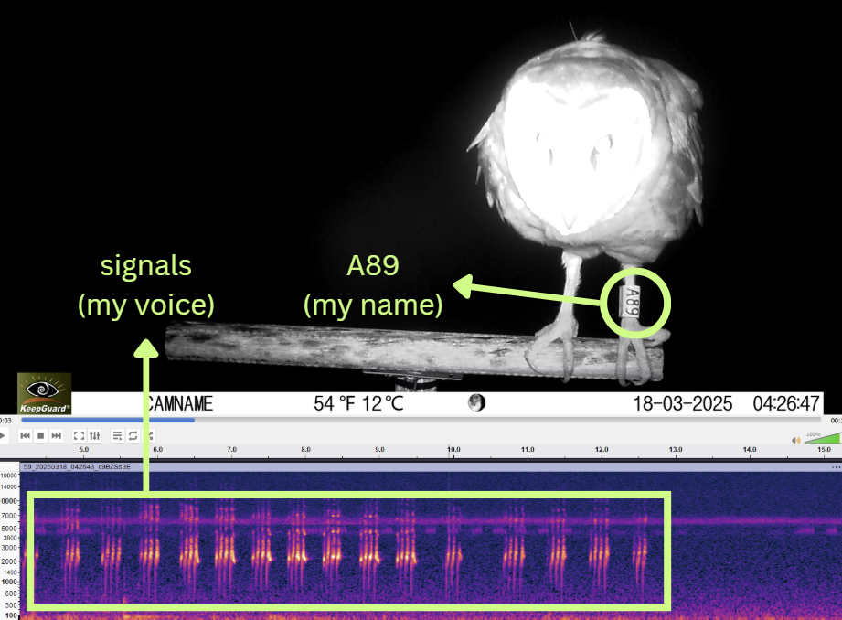

## Background

This project leverages a unique validation dataset collected from automated camera traps mounted on raptor poles in Taiwan. The dataset captures several banded Eastern Grass Owls (*Tyto longimembris*) engaging in vocal behavior directly in front of the camera.

> Because each video provides simultaneous visual confirmation of individual identity (via band numbers) and acoustic recordings of their calls, this dataset serves as an ideal empirical baseline to test vocal individuality.



To evaluate the feasibility of acoustic individuality tracking before scaling to a island-wide monitoring network, we established a prototype pipeline using 5 distinct, visually identified owls. If their acoustic features cluster reliably, it confirms that deep-learning feature extraction can be used for passive, non-invasive individual tracking.

## Functions and packages

```{r}
#| warning: FALSE

source(here::here("R", "00_functions_packages.R"))

```

## Extract audios from video

```{r}
video_root <- "E:/2026_eastern_grassowl_Taiwan/TAIGA_video"

folder_list <- list.dirs(path = video_root,
                         full.names = TRUE,
                         recursive = FALSE)
```

::: panel-tabset
## Check structure

```{r}
dir_tree(video_root, recurse = FALSE)
```

## How many videos

```{r}
video_summary <- tibble(folder_path = folder_list) %>% 
  mutate(folder_name = basename(folder_path),
         total_videos = map_int(folder_path, 
                                ~{list.files(path = .x, 
                                             pattern = "\\.mp4$", 
                                             recursive = TRUE,
                                             ignore.case = TRUE) %>% length()})) %>% 
  select(folder_name, total_videos)

knitr::kable(video_summary, col.names = c("Site / Owl Folder", "Total Video Files (.mp4)"))
```
:::

The `extract_audio_files()` function extract the audio from the raw camera trap videos and saves it as `.wav` audio files. It automatically recreates the exact same folder structure inside your audio folder to keep everything organized. If the function sees that a video's audio has already been extracted, it simply skips it. This means you can run this function whenever you add new videos from the field, and it will only process the brand-new files without wasting time re-doing the old ones.

```{r}
#| eval: FALSE

extract_audio_files(video_root)

```

The `build_audio_metadata()` function gathers and organizes all the technical details from the files into a clean table. It looks inside the video and audio folders, pulls out background information (like recording dates, file sizes, and audio quality), and safely handles missing audio files without crashing. Finally, it reads your folder names to automatically figure out which owl ID and study site the files belong to, giving you a tidy spreadsheet ready for analysis.

```{r}
#| warning: FALSE
#| cache: TRUE

# this chunk takes about one minute to run

metadata_all <- build_audio_metadata(video_folder = "E:/2026_eastern_grassowl_Taiwan/TAIGA_video",
                                     audio_folder = "E:/2026_eastern_grassowl_Taiwan/TAIGA_audio")

```

::: panel-tabset
## Look at head

```{r}
head(metadata_all)
```

## Look at tail

```{r}
tail(metadata_all)
```
:::

::: panel-tabset
## Check owls

Check the recordings from each owl / site combination

```{r}
#| message: FALSE

metadata_all %>%
  group_by(owl_id, site) %>%
  summarize(audios = n())
```

## Check time

Check the hours that owl got recorded. Only after 6pm, and before 5am.

```{r}
metadata_all$datetime %>%
  hour() %>%
  unique() %>%
  sort()
```
:::

Save this cleaned metadata for later use

```{r}
#| eval: FALSE

write_csv(metadata_all, here("data", "taiga_audio_metadata_5_owls.csv"))
```

## Energy based sound event detection

While we evaluated template-based detection methods, the high variability in the owls' call notes made it difficult to establish a single matching template. Consequently, we opted for an energy-based detection approach, which is much better suited for capturing these dynamic signal variations.

```{r}
#| message: FALSE

audio_data <- read_csv(here("data", "taiga_audio_metadata_5_owls.csv")) 
```

Set some detection parameters. Tested with various thresholds. Seems like 20 provided the best results. Take one audio to check.

```{r}
audio_file <- audio_data$filepath_audio[48]
threshold_detection <- 20
```

::: panel-tabset
## Original detection

The energy detector isolates signals above our threshold within a 1–5 kHz frequency band, targeting the specific vocal range of the Eastern Grass Owl. We applied a 500 ms smoothing window to bridge brief drops in signal intensity, and used a hold-time parameter to merge short, closely spaced detections into a single call sequence.

```{r}
#| cache: TRUE
#| message: FALSE

# this chunk takes about 30 secs to run

detection <- energy_detector(files = basename(audio_file),
                             path = dirname(audio_file),
                             bp = c(1, 5),
                             threshold = threshold_detection,
                             smooth = 500, 
                             hold.time = 1500) 
  
sound <- readWave(audio_file)
label_spectro(wave = sound,
              detection = detection,
              envelope = TRUE,
              threshold = threshold_detection,
              flim = c(0.5, 5.5))
```

## Padded detection

Detections were padded to lengths of exact 3-second multiples (3, 6, 9, 12, or 15 seconds) to align with the fixed 3-second analysis window utilized by BirdNET. This step ensures that every target signal is perfectly contained within the model's expected input structure.

```{r}
#| cache: TRUE
#| message: FALSE

# this chunk takes about 30 secs to run

detection_padded <- extract_audio_events(audio_file,
                                         threshold_detection = threshold_detection,
                                         visualize = FALSE)

sound <- readWave(audio_file)
label_spectro(wave = sound,
              detection = detection,
              reference = detection_padded,
              envelope = TRUE,
              threshold = threshold_detection,
              flim = c(0.5, 5.5))
```
:::

## Getting detection metadata

Load the audio metadata

```{r}
#| message: FALSE

audio_data <- read_csv(here("data", "taiga_audio_metadata_5_owls.csv")) 
```

Loop the extraction function through all the audios and combine the detected results

```{r}
#| cache: TRUE
#| message: FALSE

# this chunk takes few minutes (about 10 mins) to run

event_detections <- map2_df(audio_data$filepath_audio,
                            audio_data$audio_id,
                            function(path, id) {
                              extract_audio_events(path, threshold_detection = 20, visualize = FALSE) %>%
                                as_tibble() %>%
                                mutate(audio_id = id)})

metadata_event_detections <- event_detections %>%
  left_join(audio_data, by = "audio_id") %>%
  rename(clip_length = duration.x) %>%
  mutate(clip_id = paste0(audio_id, "-", selec)) %>%
  select(owl_id, site, datetime, selec, start, end, clip_length, filepath_audio, audio_id, clip_id)
```

Take a peak at the results

::: panel-tabset
## Check head

```{r}
head(metadata_event_detections)
```

## Check columns

```{r}
metadata_event_detections %>% head (2) %>% glimpse()
```
:::

Summarize how many clips are extracted for each of the owl

```{r}
metadata_event_detections %>%
  mutate(segment_length = fct_rev(factor(segment_length)))%>%
  ggplot() +
  geom_bar(aes(fill = clip_length,
               x = owl_id),
           position = "stack",
           stat = "count") +
  scale_fill_viridis(discrete = T) +
  labs(y = "No. of segments",
       x = "Owl ID",
       fill = "Length (s)")


```

Save this cleaned metadata for later use

```{r}
#| eval: FALSE

write_csv(metadata_event_detections, here("data", "taiga_audio_events_metadata_5_owls.csv"))
```

### Analytical Workflow

The automated pipeline processes the data through four major sequential stages:

1.  **Audio Extraction** Demuxing raw `.mp4` camera trap footage into high-fidelity, uncompressed `.wav` audio tracks to preserve structural call characteristics.
2.  **Vocalization Segmentation (`ohun`)** Isolating target vocalizations using amplitude envelope smoothing. Detections are dynamically padded into symmetric, centered intervals matching perfect multi-multiples of BirdNET processing constraints (3s, 6s, 9s).
3.  **Deep Feature Extraction (BirdNET)** Passing the isolated clips through the BirdNET architecture to capture a **1024-dimensional acoustic fingerprint** (feature embeddings) for every vocal event.
4.  **Multivariate Space Mapping** Applying unsupervised dimensionality reduction (UMAP) and distance-metric clustering to determine if the acoustic structures group cleanly by their visually verified band numbers.

## Running Code

When you click the **Render** button a document will be generated that includes both content and the output of embedded code. You can embed code like this:

```{r}
1 + 1
```

You can add options to executable code like this

```{r}
#| echo: false
2 * 2
```

The `echo: false` option disables the printing of code (only output is displayed).
