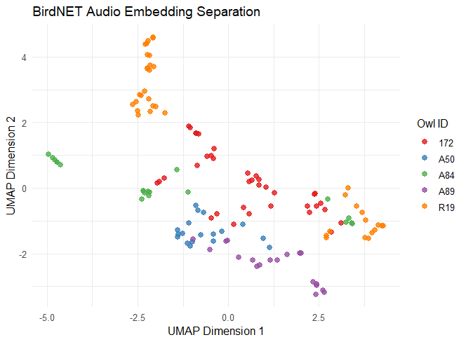
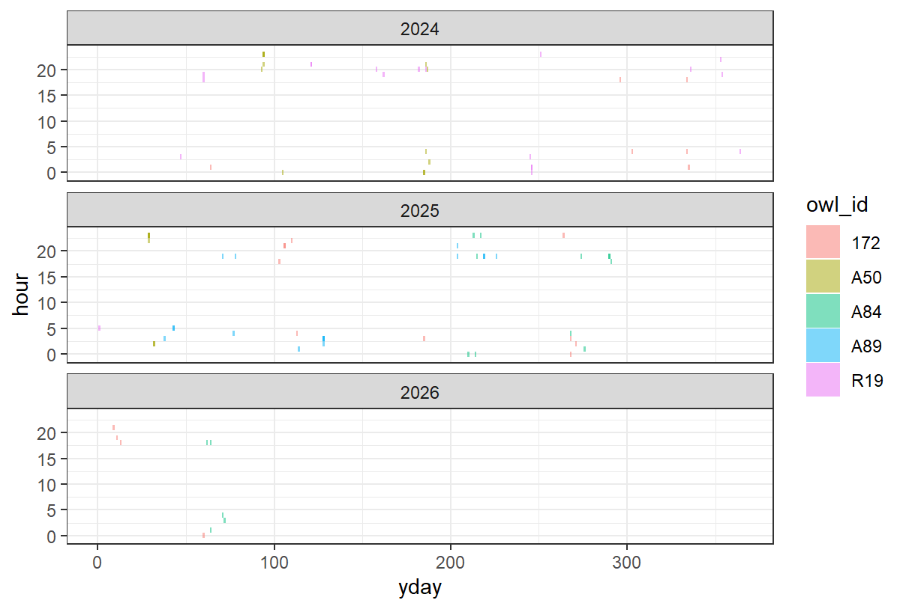

## 2026 Jun.16

-   Downloaded files from Dropbox. In most of the case, one single owl occupied the same single site. There are cases that multiple owls can be detected in the same site, or one owl got detected in multiple sites.

-   Extracted audio from video

### To do:

-   [x] extract date and time from video (shown in the filename?

-   [ ] run the audio through BirdNET (GUI) -\> clip the audio to only retain the vocalizing period -\> extract embedding (R? Python?)

## 2026 Jun.17

-   Set up the for loop for auto extraction of audio and metadata

### To do:

-   [x] Extract owl ID, and site as two additional columns

-   [ ] Automate the loop for all the folders - one big metadata

-   [x] Keep the "audio path" maybe!? for future mapping

## 2026 Jun.18

-   Finished the "function" extracting audios and metadata from video folders

## 2026 Aug.26

-   Created the embedding separation, using only 3 sec clips full with vocalization. Seems like there are some separation.

-   Two clusters of orange - potentially from the "non insect" vocalization. Need to remove

## 2026 Sep.17

-   Added one figure to visualize the owl vocalization across time (day and hour)

-   But need more data to be visually meaningful, I think.

-   Still waiting for more video to come - have contacted Shiao for more data.

## Big Picture

1.  Extract audio from video, with metadata
2.  Extract clips of sounds from audio (by BirdNET GUI)
3.  Extract BirdNET embedding from each vocalization for each owls
4.  Run multi-variance analysis to see the similarity
